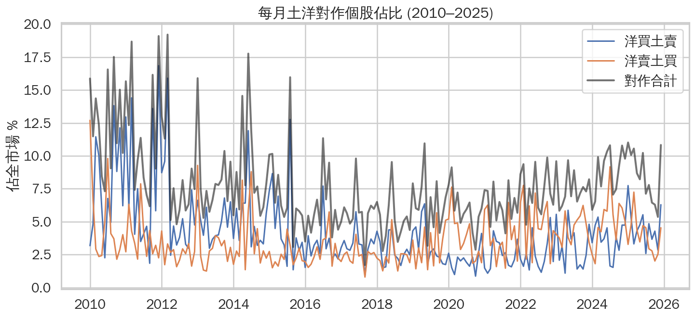
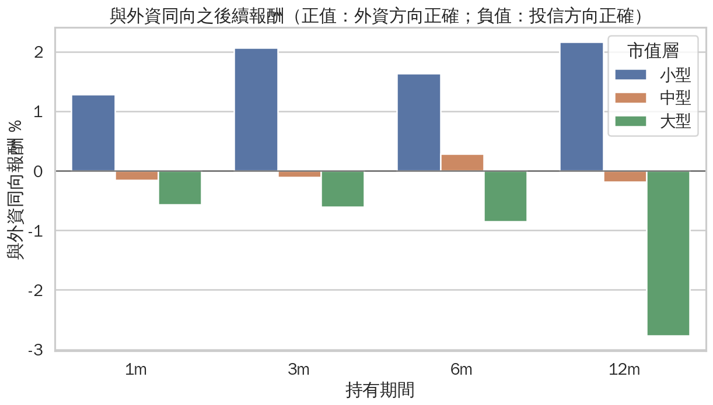
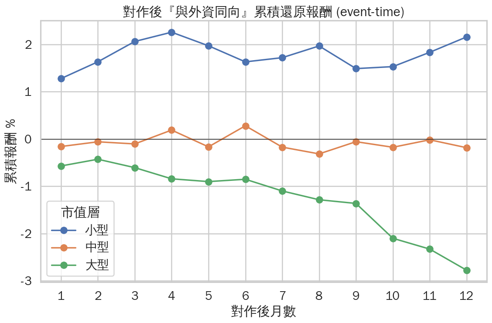
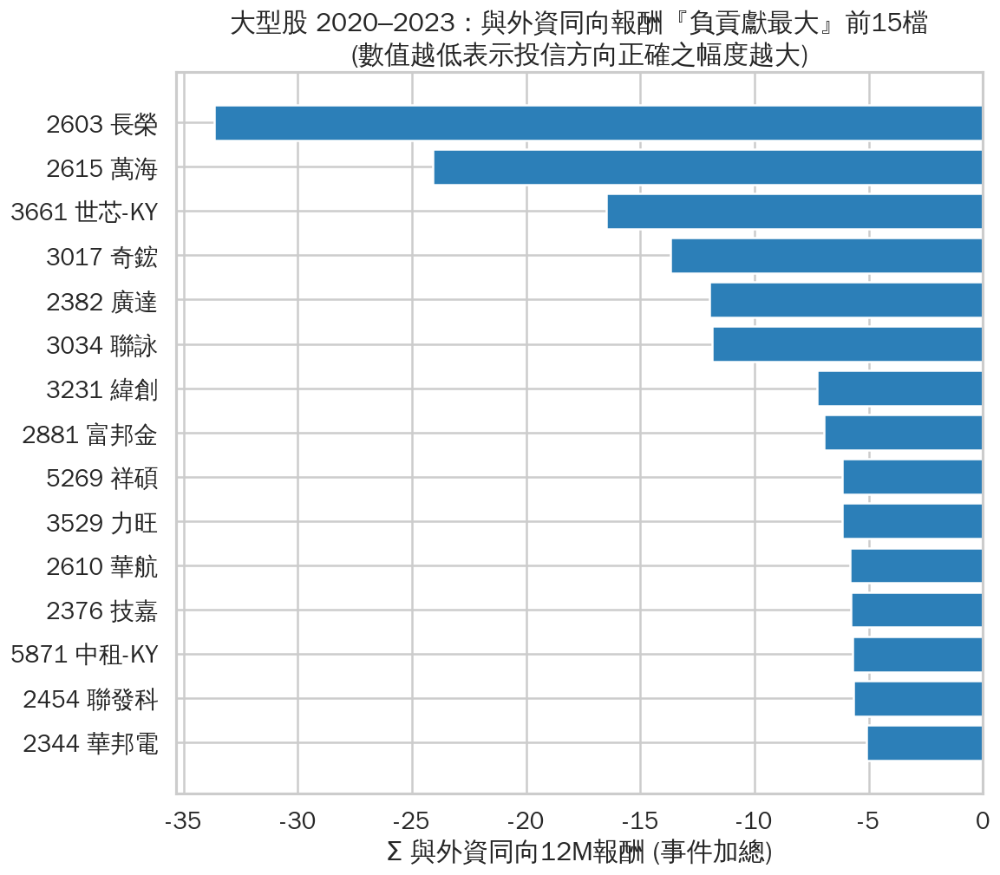
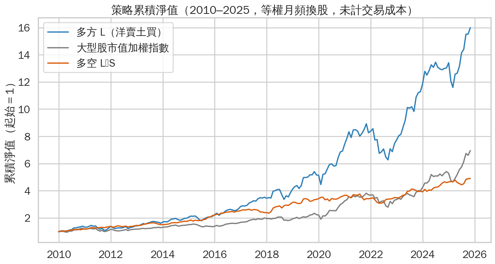
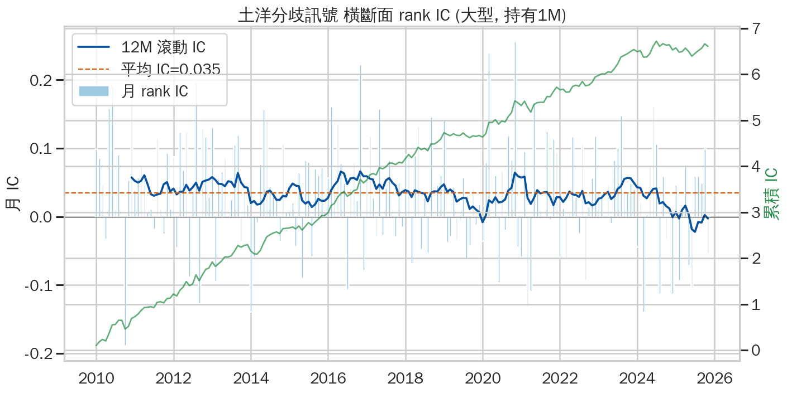
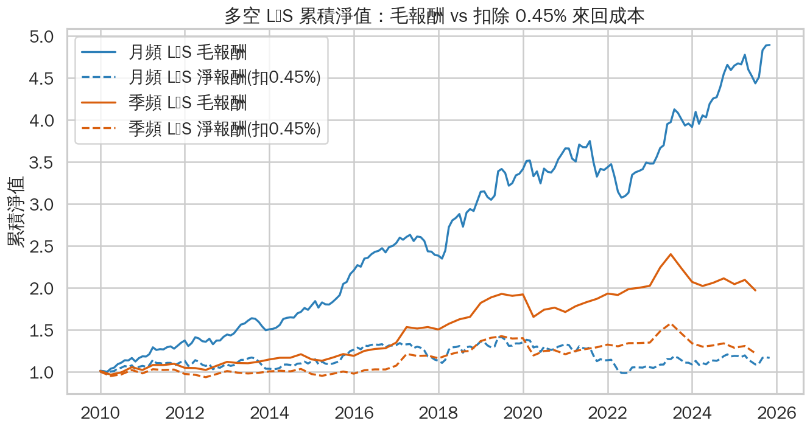

# 台股土洋對作統計分析

當外資（「洋」）與投信（「土」）於同一標的、同一月份採取相反方向時，稱為「**土洋對作**」。
本專案採用 TEJ 月頻資料（2010–2025，全市場 1,941 檔），統計對作之**分布特徵**與**後續報酬**，
並延伸至**多空回測、alpha/beta 分離、IC/ICIR 分析，以及交易成本與訊號衰退之檢驗**。

---

## 研究結論摘要

1. **主要現象**：對作發生時，大型股後續走勢與投信一致、小型股與外資一致。大型股「與外資同方向」之 12 個月報酬為 −2.8%（t≈−7，n≈15,500）。
2. **本質為市場 beta**：此長天期效應集中於 2020–2023 多頭期間，主因係外資逆勢賣出當期強勢權值股（2021 航運、2023 AI），而非投信之選股能力。
3. **短天期存在超額報酬**：連續「土洋分歧」訊號於大型股之 1 個月 rank IC 為 0.035，**年化 ICIR 1.53、t=6.1**；市場中性多空組合 β≈0，毛年化 α 為 10.3%。
4. **惟成本偏高且已衰退**：多空組合月週轉率達 84%，**扣除 0.45% 來回成本後 α 僅餘 1.3%**；分期檢驗顯示 **2024–2025 年 ICIR 由 >1.6 驟降至 0.13**，訊號已大幅失效。

> 綜言之，該訊號具統計顯著性，惟於零售交易成本下不具獨立可執行性，且自 2024 年起已失效；較適合作為多因子模型中之輔助訊號，而非單一策略。

---

## 一、資料

| 檔案 (parquet) | 內容 | 涵蓋 |
|---|---|---|
| `institutional` | 外資/投信/自營 買賣超（流量）+ 外資/投信持股率（存量） | 2010-01~2025-12, 1941 檔 |
| `price_adj` | 還原月股價（供報酬計算） | 同上 |
| `price_unadj` | 未還原月股價、成交量、市值 | 同上 |
| `margin` | 融資融券餘額、券資比 | 1825 檔 |
| `industry` | TSE/TEJ 產業別、上市別（TSE 1051 / OTC 891） | static |

- 頻率為**月頻**（192 個月）。原始 TEJ Excel 置於 `data/raw/`，欄位對照見 `data/README_columns.md`。
- 限制：月頻資料僅能反映月級之部位背離，無法捕捉短天期之精確進出。
- TEJ 為授權資料，**未納入版本控制**（`.gitignore`）；執行 `src/00_ingest.py` 可由使用者自身之 TEJ 帳號重建。

## 二、方法

- **對作定義（流量法，主）**：`sign(外資月買賣超) ≠ sign(投信月買賣超)`，且兩者皆非零。
  `洋買土賣`為外資買、投信賣；`洋賣土買`為外資賣、投信買。
- **穩健性交叉驗證（持股率法）**：`sign(Δ外資持股率) ≠ sign(Δ投信持股率)`；兩法**一致率達 86%**，顯示月度加總之自我抵銷影響有限。
- **後續報酬**：以還原收盤價計，自對作月**次月起算** 1/3/6/12 個月（避免前視偏誤）。
- **方向歸屬指標**：`與外資同向報酬 = 外資方向 × 後續報酬`（外資買進計為做多、賣出計為做空）；大於零表示外資判斷正確，小於零表示投信正確。
- **市值分層**：每月依市值分為小/中/大型（分位數 0–50–80–100%）。

---

## 三、對作之分布



每月對作個股佔全市場約 **3%~19%**：2010–2012 年頻率最高，2016 年前後降至低點，2020 年後緩步回升。
洋買土賣與洋賣土買長期大致均衡（各約 3.6~4.1%）。產業與市值分布另見 `desc_industry_heatmap.png`、`desc_mcap_board.png`。

---

## 四、方向歸屬：大型股與投信一致、小型股與外資一致



「與外資同向報酬」依市值層拆解（大於零外資正確、小於零投信正確）：

| 持有期 | 小型 | 中型 | 大型 |
|---|---|---|---|
| 1M | +1.28% \* | −0.16% | **−0.57%** \*\*\* |
| 3M | +2.06% \* | −0.11% | **−0.61%** \*\*\* |
| 6M | +1.63% | +0.28% | **−0.85%** \*\*\* |
| 12M | +2.16% | −0.18% | **−2.77%** \*\*\* |

（\* p<0.05、\*\*\* p<0.001；大型股 n≈15,500、t≈−7~−10）



事件時間之累積曲線更為明確：**大型股（綠）於 12 個月內單調下滑至 −2.8%（投信正確），小型股（藍）上行至 +2.2%（外資正確），中型股大致持平。**

**絕對勝率**亦呈一致結論——投信買方於各持有期皆優於外資買方（12M：投信買方 56.3%／+13.6%，外資買方 51.9%／+8.5%，詳見 `rob_winrate.png`）。

---

## 五、歸因：大型股「投信正確」實為 2020–2023 之方向效應



深入檢視 2020–2023 年大型股對作事件（n=4,774，平均與外資同向報酬 −7.5%），得出**重要修正**：

- **此現象非源於投信之選股能力，而係多頭期間之方向效應。** 依方向拆解，`洋賣土買`（投信為買方）n=3,068，後續報酬 +23%；
  2020–2023 年市場普遍上漲、買方即獲利，而投信居買方之次數約為外資之兩倍，故加總後呈現「投信正確」。其本質為**外資逆勢調節權值股、方向判斷錯誤**。
- **集中於當期主流標的**：拖累外資最深者為 **2021 年航運三雄**（長榮 −168%、萬海、華航）與 **2023 年 AI/半導體**（世芯、廣達、緯創、聯詠、聯發科）。
- **並非單一離群值所致**：中位數 −4.7%、5% 截尾平均 −6.2%、與外資同向之勝率僅 42.8%，顯示窗內廣泛成立；惟前 10 檔仍佔負貢獻之 28%（呈中度集中於主題股）。

> 因此**不宜外推為「投信長期優於外資」**；2012–2014、2017、2024 年即反轉為外資略佔上風。此段報酬屬 beta，而非 alpha。

---

## 六、多空回測：alpha 抑或 beta？

**多空建構**：母體為每月市值前 20% 之大型股；多方 L 為當月 `洋賣土買` 標的等權持有次月，
空方 S 為當月 `洋買土賣` 標的等權，`LS = L − S`，每月換股、金額中性、未計成本。以 CAPM `R = α + β·大盤` 迴歸剝離 beta：

| 策略 | 年化報酬 | Sharpe | β | 年化 α | α 之 t 值 |
|---|---|---|---|---|---|
| 多方 L（相對大型指數）| 19.2% | 1.06 | 0.99 | +5.9% | 2.28 \* |
| **多空 L−S（相對大型指數）** | 10.5% | 1.09 | **0.01** | **+10.3%** | **4.15 \*\*\*** |
| 大型股市值加權大盤 | 13.4% | 0.88 | — | — | — |



**結果顯示確有 alpha，非僅 beta。** 純做多版帶有 β≈1（近似大盤），多空版之 β 降至 0.01（近乎市場中性、R²≈0），
年化 10.3% 幾近全數為 alpha、t=4.15。多空組合（橘）平穩上行，純做多組合（藍）則因 beta 累積至 16 倍。

### IC / ICIR：訊號預測力

改採連續訊號 **土洋分歧 = 月內 `z(投信買超比率) − z(外資買超比率)`**，計算橫斷面 Spearman rank IC：



| 母體 | 持有期 | 平均 IC | 年化 ICIR | IC 之 t 值 | IC 為正比例 |
|---|---|---|---|---|---|
| **大型** | **1M** | **0.035** | **1.53** | **6.10** | 68% |
| 大型 | 3M | 0.026 | 1.25 | 4.97 | 64% |
| 大型 | 6M | 0.017 | 0.78 | 3.07 | 61% |
| 全市場 | 1M | 0.003 | 0.18 | 0.73 | 52% |

**大型股訊號具實質預測力**（ICIR 1.53、t=6.1），**全市場則趨近於零**，顯示 alpha 僅存在於大型股。
累積 IC（綠線）自 2010 年穩定累積至 2024 年，而 **2024–2025 年轉為持平並下滑**。

---

## 七、可執行性：交易成本與訊號衰退



多空組合**每月單邊週轉率約 84%**（訊號更替頻繁）。扣除不同來回成本後之淨年化報酬：

| 來回成本 | 月頻 LS | 月頻 LS α | 季頻 LS | 月頻純多 L |
|---|---|---|---|---|
| 0%（毛）| 10.5% | 10.3% | 4.7% | 19.2% |
| 0.30% | 4.5% | 4.3% | 2.7% | 16.1% |
| **0.45%（台股實際）**| **1.4%** | **1.3%** | 1.7% | 14.6% |
| 0.60% | −1.6% | −1.7% | 0.6% | 13.1% |

**市場中性多空之 alpha 於實際成本下幾近消失**（0.45% 成本下僅餘 1.3%，0.6% 即轉為負值）；改採季頻換股亦無法改善（週轉率仍約 85%）；
純做多版雖較抗成本，惟其報酬幾乎全數來自大型股 beta。淨值圖中毛報酬累積至 4.9 倍，扣除 0.45% 成本後 16 年間僅維持於 1.0–1.4 倍。

**分期檢驗訊號衰退**（大型股 1M rank IC）：

| 期間 | 平均 IC | 年化 ICIR | IC 為正比例 |
|---|---|---|---|
| 2010–2019 | 0.039 | 1.79 | 70% |
| 2020–2023 | 0.039 | 1.64 | 67% |
| **2024–2025** | **0.003** | **0.13** | 61% |

**衰退並非漸進、而係驟降**：2010–2023 十四年間 ICIR 穩定高於 1.6，2024 年後降至近乎無效。反轉集中於建材營造、水泥、鋼鐵、半導體等產業
（`cd_2024_industry.png`，外資於此類標的轉為判斷正確之一方）。可能成因（本資料無法直接證實）：被動 ETF 化、外資交易結構改變，或訊號經市場學習後之 alpha 遞減。

---

## 八、穩健性與注意事項

- **時期依賴**：大型股投信正確之現象於 16 年中有 10 年成立，強度集中於近年（詳見第五節歸因）。
- **月頻限制**：流量之月度加總會低估月內來回，已以持股率法交叉驗證（一致率 86%）。
- **成本與放空假設**：回測未計交易成本以外之實務摩擦，並假設大型股可放空（借券成本未計）。
- **缺漏值**：自營避險約 30% 缺漏（未納入主訊號）、券資比約 8% 缺漏、融資融券少 116 檔（多為 ETF）。
- **存續者偏誤**：資料含下市個股，事件研究保留當期存續者即可。

---

## 九、程式與重現

```
config.py                 # 門檻、forward horizons、seaborn 樣式（集中設定）
src/
  00_ingest.py            # xlsx -> parquet + 欄位標準化
  01_panel.py             # 月頻主表 + forward 報酬 + 持股率變化 + 市值分層
  02_signals.py           # 對作訊號（流量法 + 持股率法穩健性）
  03_descriptive.py       # 描述性統計圖表
  04_event_study.py       # 事件研究：方向歸屬
  05_robustness.py        # 大型股深掘 + 絕對勝率 + 累積曲線
  06_deepdive.py          # 2020-2023 投信正確之歸因（個股/產業/方向/離群）
  07_backtest.py          # 多空回測 + CAPM alpha/beta 分離 + IC/ICIR
  08_costs_decay.py       # 交易成本/換股頻率敏感度 + 分期IC衰退 + 2024-25反轉歸因
  plotstyle.py            # seaborn + 中文字型
data/   (raw/ parquet/ 由 gitignore 排除)  outputs/{figures,tables}/
```

重現步驟：`pip install pyarrow` → `python3 src/00_ingest.py` → `01` → … → `08`。
調整門檻、分層或持有期僅需修改 `config.py`，全流程一致套用。所有統計數字均輸出至 `outputs/tables/*.csv`（UTF-8-SIG，可直接以 Excel 開啟）。
